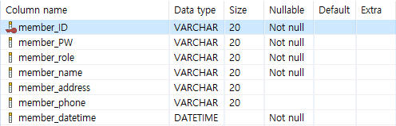
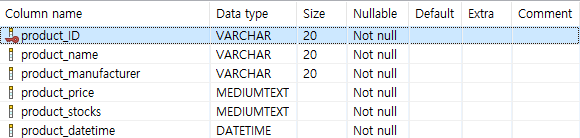
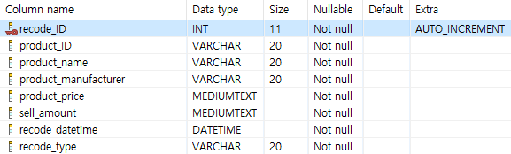

# POS_Syetem
4학년 1학기 '스프링프레임워크' 기말 프로젝트

# <소개>
- 스프링프레임워크(Spring framework) POS 시스템(Point of Sale System) 프로젝트
- 데이터베이스(MySQL)를 활용하여, 회원, 상품, 재고의 CRUD 구현
- POS 시스템의 기본적인 계정, 재고 관리, 판매, 통계 기능 구현
- 웹서버는 <a href = "Apache Tomcat" >Apache Tomcat</a>을 사용

  ## 객체
    - 시스템의 CRUD를 위한 객체 (데이터베이스 테이블과 그에 매칭되는 자바 클래스)
    
    ### Member
    
     
      - member_ID : 계정 아이디 (Primary Key)
      - member_PW : 계정 비밀번호
      - member_role : 계정 직위 (종류 : admin, manager, parttimer)(시스템 접근권한 차등)
      - member_name : 계정 이름
      - member_address : 주소
      - member_phone : 연락처
      - member_datetime : 생성시간(입사일)
     (<a href = "https://github.com/kkhdss165/-project-POS_Syetem/blob/main/src/main/java/object/Member.java">Member.java</a>에 매칭)
     
    ### Product
     
     
      - product_ID : 제품코드 (Primary Key)
      - product_name : 제품명
      - product_manufacturer : 제조사
      - product_price : 제품 가격
      - product_stocks : 제품 수량(재고)
      - prodcut_datetime : 입고일(재입고일)
     (<a href = "https://github.com/kkhdss165/-project-POS_Syetem/blob/main/src/main/java/object/Product.java">Product.java</a>에 매칭)
     
    ### Recode
    
     
      - recode_ID : 판매기록 아이디 (Primary Key)(Auto_Increment)
      - product_ID : 제품코드
      - product_name : 제품명
      - product_manufacturer : 제조사
      - product_price : 제품 가격
      - sell_amount : 판매량
      - recode_datetime : 판매시간
      - recode_type : 판매기록 종류( normal: 정상거래, refund: 환불)
     (<a href = "https://github.com/kkhdss165/-project-POS_Syetem/blob/main/src/main/java/object/Recode.java">Recode.java</a>에 매칭)
  
  ## 기능
  
## <개발환경>
- IDE : Eclipse
- Web Server : Apache Tomcat
- Hardware : AMD RYZEN 2200G(4core) RAM 8GB

## <개발기간>
- 2022년 6월(1주)

## <참조>
- <a href = "https://github.com/kkhdss165/-project-POS_Syetem/blob/main/report/%EA%B0%9C%EB%B0%9C%EB%B3%B4%EA%B3%A0%EC%84%9C.pdf">개발보고서</a>
- <a href = "https://github.com/kkhdss165/-project-POS_Syetem/blob/main/report/%EC%82%AC%EC%9A%A9%EC%9E%90%EB%A9%94%EB%89%B4%EC%96%BC.pdf">사용자메뉴얼</a>
